# Add a toolchain to an app

In a few minutes, you can create a toolchain from an IBM Cloud® app and then use that toolchain in an IBM Cloud environment. IBM Cloud is an open-standards, cloud-based platform for building, running, and managing applications.

A toolchain is a set of tool integrations that support development, deployment, and operations tasks. The collective power of a toolchain is greater than the sum of its individual tool integrations. You can assemble all of the services that your IBM Cloud app needs to succeed, such as issue tracking and source control, and integrate them in minutes.

In this tutorial, you create an app on IBM Cloud by using the SDK for Node.js starter pack. Then, you create a toolchain for your app. The toolchain includes a GitHub repository (repo) that contains the app's source code, a delivery pipeline, and the Eclipse Orion Web IDE for editing. The toolchain is associated with both the GitHub repo and your app.

After you create the toolchain, you change your app's code and push the change to the GitHub repo. When you push changes to your GitHub repo, the delivery pipeline automatically builds and deploys the code that is in the repo.

## Pre-requisites

You must have an IBM Cloud account. If you don't have one, sign up for a trial. The account requires an IBMid. If you don't have an IBMid, you can create one when you register with this link - https://ibm.biz/Bdf4qx

A GitHub account. If you don't have one, sign up.

Verify the toolchains and tool integrations that are available in your region and IBM Cloud environment. A toolchain is a set of tool integrations that support development, deployment, and operations tasks.

A Cloud Foundry Organization and Space to deploy your application. View or create one on the Cloud Foundry Orgs page.

## Task 1 - Create an App

1) Go to https://cloud.ibm.com/developer/appservice/dashboard

If you have an IBM Cloud account, use it to log in. Otherwise, click Create an IBM Cloud Account.

After you log in, the dashboard shows an overview of what is running on IBM Cloud and other helpful information.

  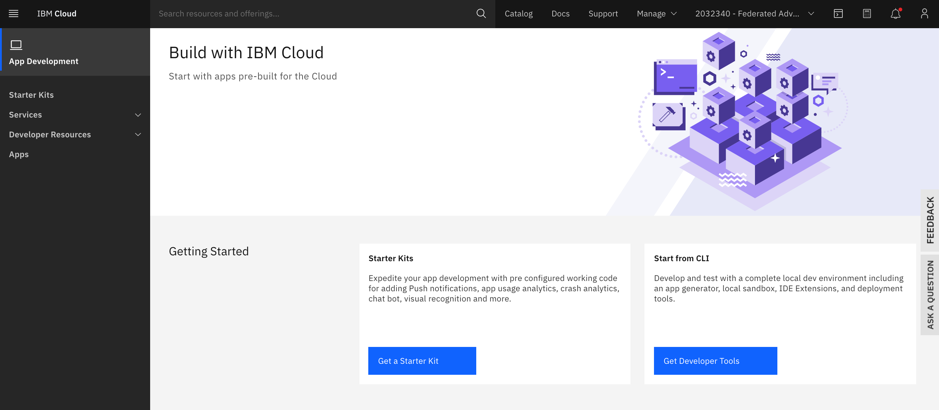
  
2) Click on `Get a Starter Kit`

3) Click on `Create App`

  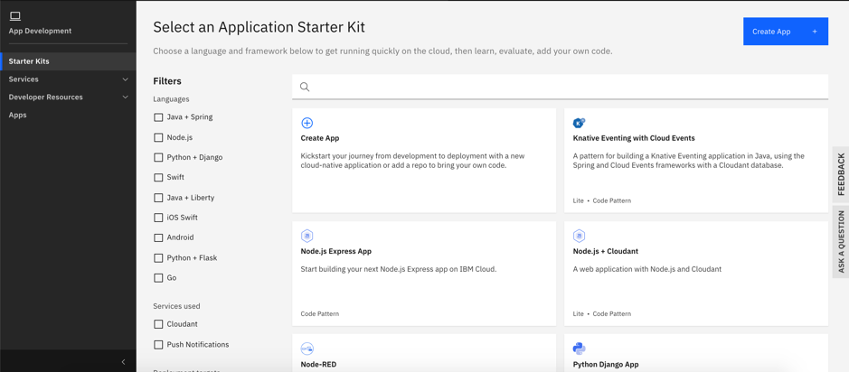

4) Click on `Get Started`

   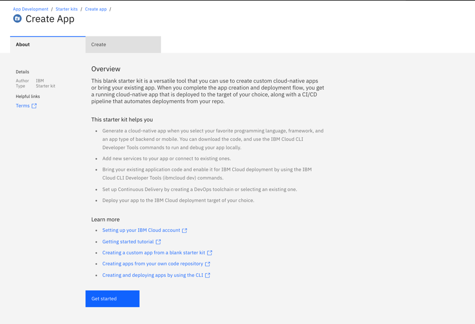  

5) In the App Name field, type a name for your app.
   
   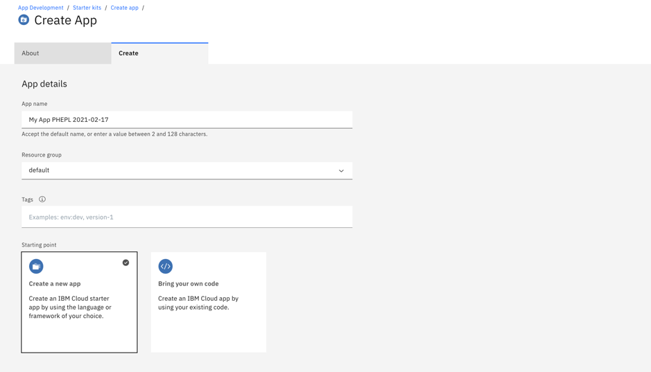
   
   Select Language: SDK for Node.js™
   
   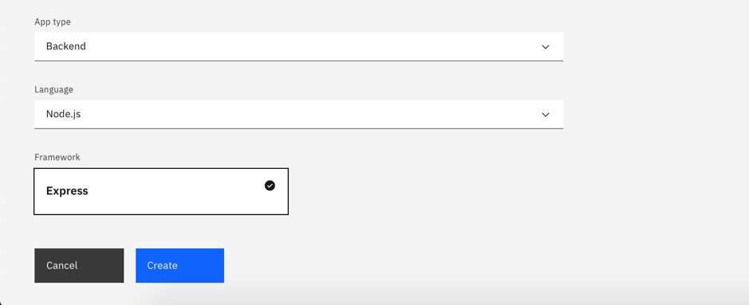

6) Click Create. The app is created.

Note: The app is not deployed nor running yet.

 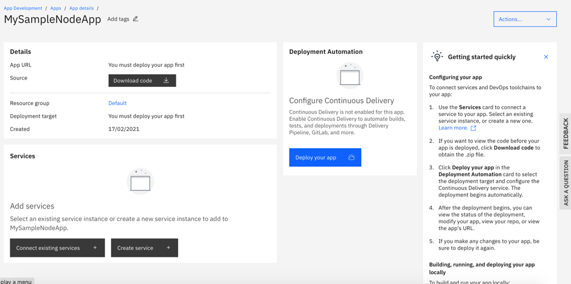
  
## Task 2 - Add a toolchain to the app

1) On your app's Overview page, on the Deploy your app card, click `Deploy your app`

2) Select deployment target by clicking ` Cloud Foundry `

  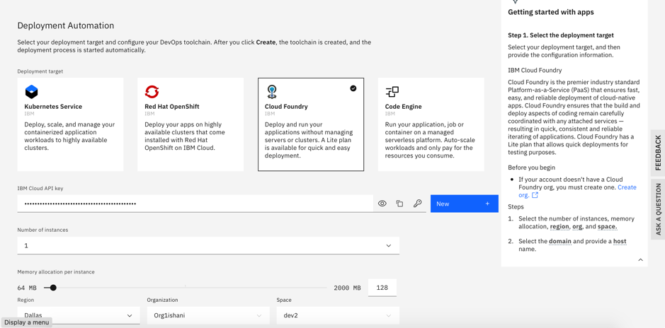

3) Click on `New` to generate an API key

4) Select the region to deploy in, the target organization, and the space.

Note: If no organization or space are displayed, create them on the Cloud Foundry Orgs page(https://cloud.ibm.com/account/cloud-foundry)
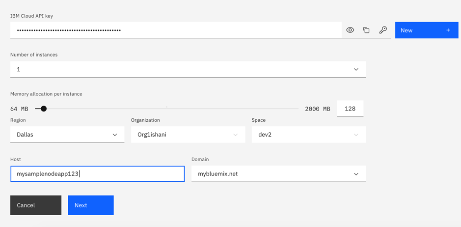

5) Click `Next`

6) Click on `Create` with below selection to create the toolchain. Wait until the toolchain is created.

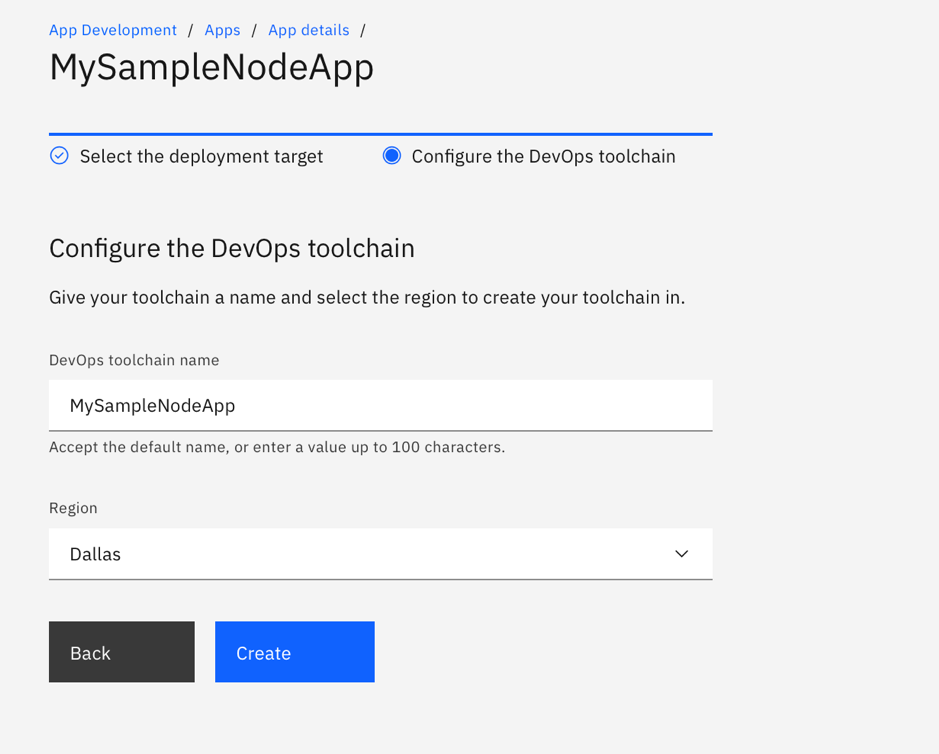

7) Click on the App name in the `Deployment Automation ` section to view the toolchain.

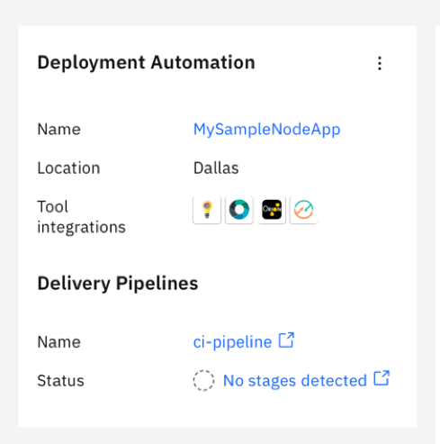

Several steps have been executed automatically to set up your toolchain:

The toolchain is created.
  * The sample code used to create the application is pushed into a new repo in your Git Repos and Issue Tracking account.
  * The delivery pipeline is created.
  * The toolchain is associated with your app. When you push changes to the toolchain's repo, the delivery pipeline automatically builds and deploys the app.
  * The Overview page for the toolchain is displayed.

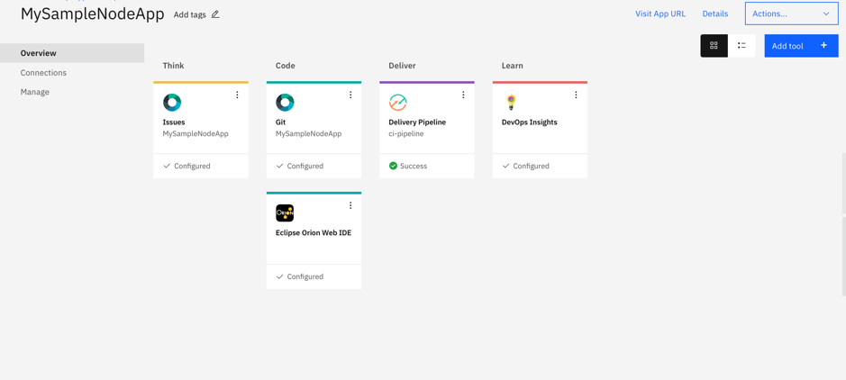

8) Click Delivery Pipeline to see the pipeline. The pipeline is running when the toolchain is first created, in order to deploy your app. When you push changes to the repository associated with the toolchain, the pipeline automatically runs.

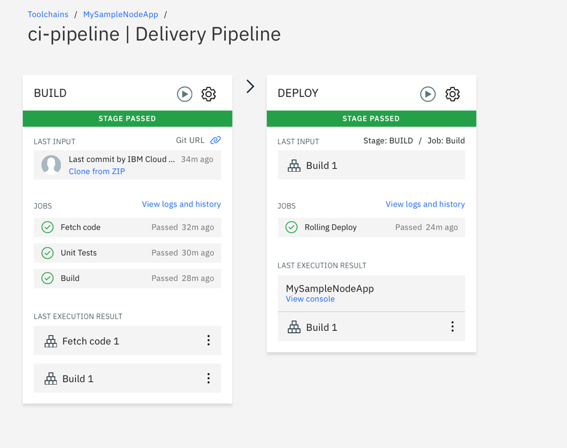

9) You can also trigger the pipeline manually, by clicking the Run Stage icon on the Build stage.

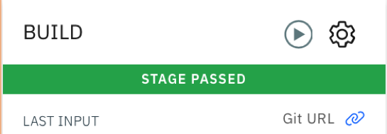

10) Click the View console link on the Deploy stage of the pipeline to return to the application dashboard.

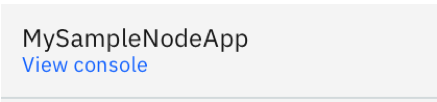

11) Click Visit App URL.

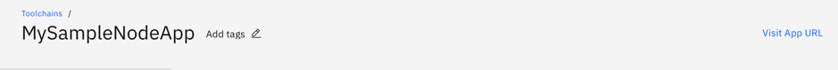

12) The running app opens in a new window.

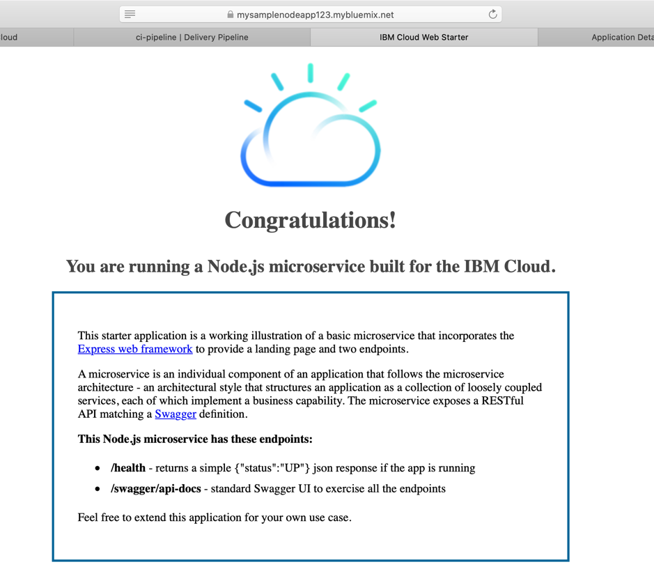

